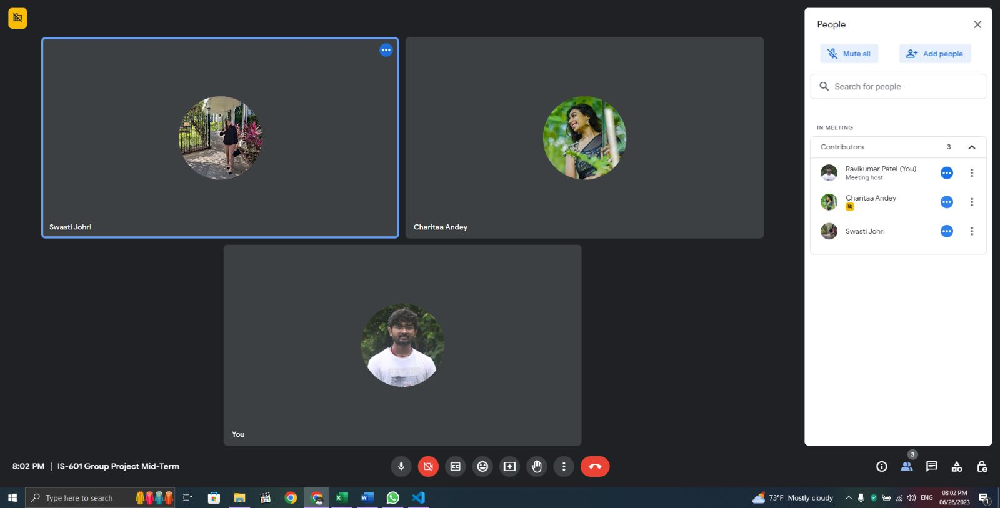
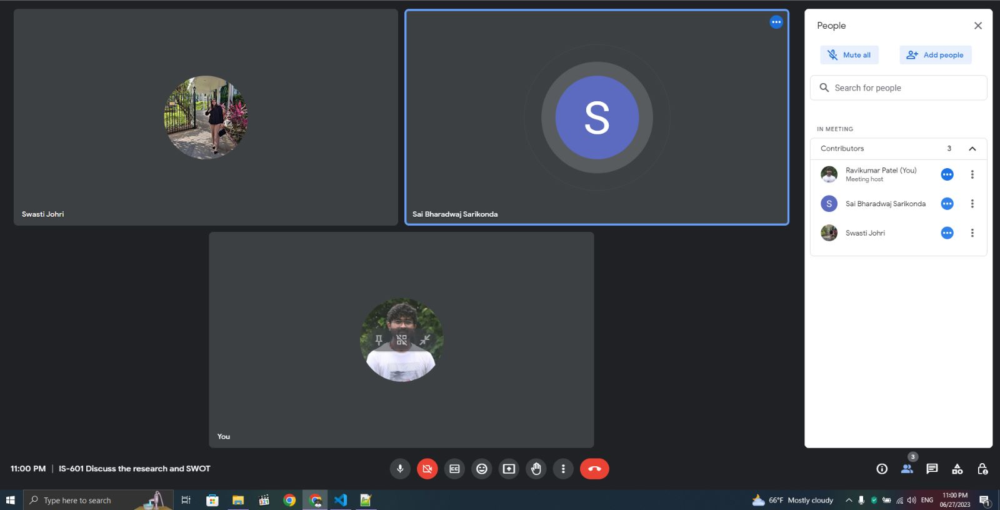
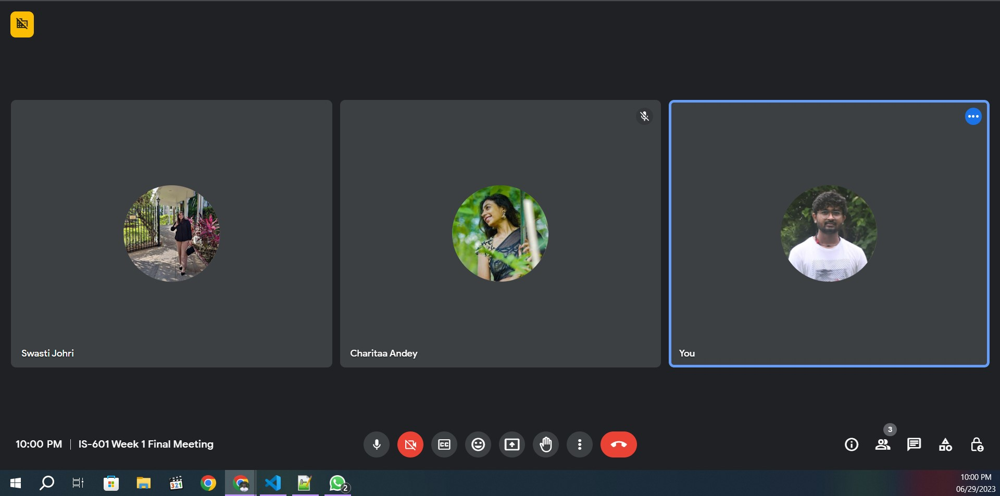

# Group Activity Report 1

| Pull Request Title | Description | Assignee | Story Points | Date Assigned | Date Completed |
| ------------------ | ----------- | -------- | ------------- | ------------- | -------------- |
| Added Company 1 Data  | Research done for the first company (Starbucks)   | Ravikumar | 5 | 06/26/2023 | 06/29/2023 |
| Brand Research 2 | Research done for the second company (Peet's Coffee) | Swasti | 5 | 06/26/2023 | 06/29/2023 |
| Brand Research 3 | Research done for the third company (Dunkin Donuts) | Charitaa | 5 | 06/26/2023 | 06/29/2023 |
| Added swot for brand_1 | SWOT Analysis for Starbucks  | Ravikumar | 5 | 06/28/2023 | 06/29/2023 |
| SWOT Analysis 2 | SWOT Analysis for Peet's Coffee  | Swasti | 5 | 06/28/2023 | 06/29/2023 |
| Updating Brand 3 SWOT | SWOT Analysis for Dunkin Donuts  | Charitaa | 5 | 06/28/2023 | 06/29/2023 |
| Group activity report | Assign story points to the contribution with whole group on call | Ravikumar | 2 | 06/29/2023 | 06/29/2023 |

## Project Contribution Percent Calculation

The project contribution percentage for each team member:

**Total Number of points:** 32
- Ravikumar's contribution percent: (12 / 32) * 100 = 37.5%
- Swasti's contribution percent: (10 / 32) * 100 = 31.3%
- Charitaa's contribution percent: (10 / 32) * 100 = 31.3%

## Meeting Attendance:

**Date:** 06/26/2023 (1 hour)

**Date:** 06/27/2023 (1 hour)

**Date:** 06/29/2023 (4 hour)

## Pull Requests Made:

