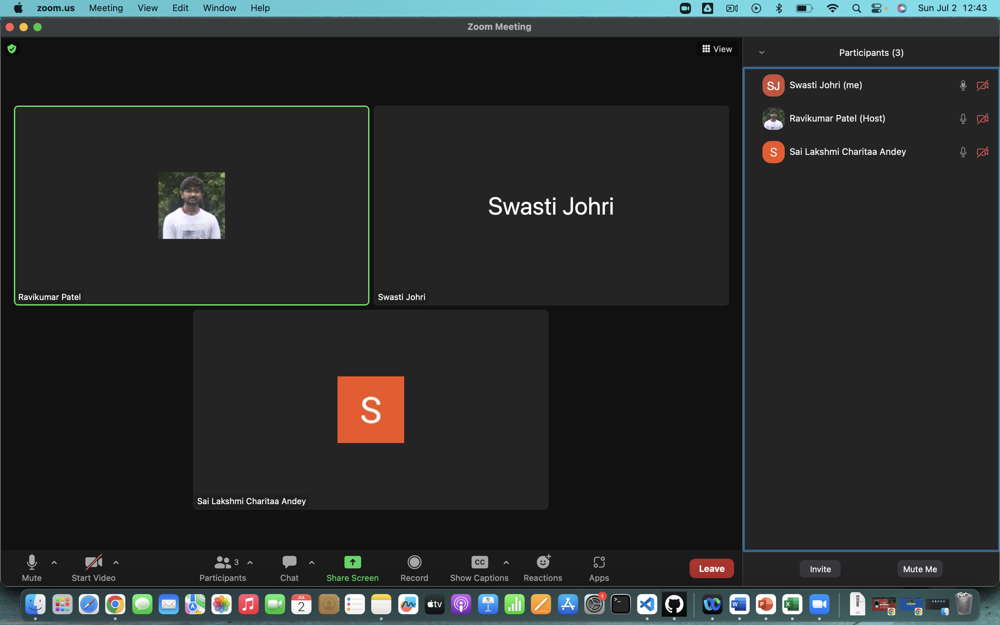
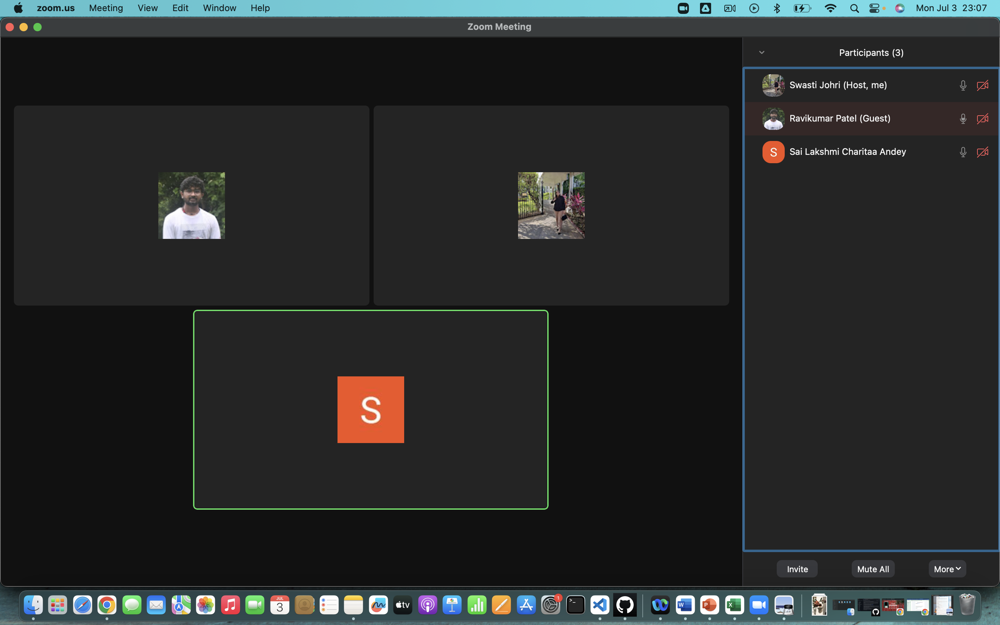
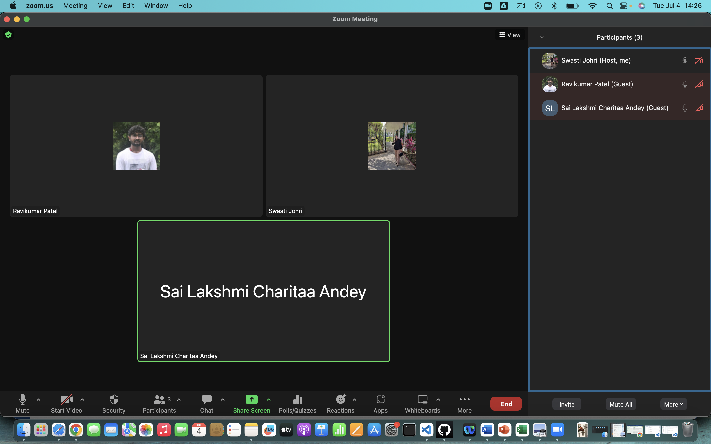

# Group Activity Report 2

| Pull Request Title | Description | Assignee | Story Points | Date Assigned | Date Completed |
| ------------------ | ----------- | -------- | ------------- | ------------- | -------------- |
| Added Brand Guide Points | Research done for brand guide (including brand name, logo, slogan, archetype, colors, typography, imagery, mission, vision, values, BANT strategy) | Swasti | 8 | 07/02/2023 | 07/03/2023 |
| Buyer Persona Points | Research done for buyer persona | Charitaa | 3 | 07/03/2023 | 07/04/2023 |
| Added Marketing Strategy Points | Research done for marketing strategy, sales funnel and six methods of persuasion | Charitaa | 5 | 07/02/2023 | 07/03/2023 |
| Figma | Created Figma file  | Ravikumar | 8 | 07/03/2023 | 07/04/2023 |
| Group Activity Report 2 | Assign story points to the contribution with whole group on call | Swasti | 2 | 07/04/2023 | 07/04/2023 |

## Project Contribution Percent Calculation

The project contribution percentage for each team member:

**Total Number of points:** 26
- Ravikumar's contribution percent: (8 / 26) * 100 = 30.7%
- Swasti's contribution percent: (10 / 26) * 100 = 38.4%
- Charitaa's contribution percent: (8 / 26) * 100 = 30.7%

## Meeting Attendance:

**Date:** 07/02/2023 (1 hour)

**Date:** 07/03/2023 (3.5 hour)

**Date:** 07/04/2023 (1.5 hour)

## Pull Requests Made:

![Pull Request Page 1]

![Pull Request Page 2]

![Pull Request Page 3]
