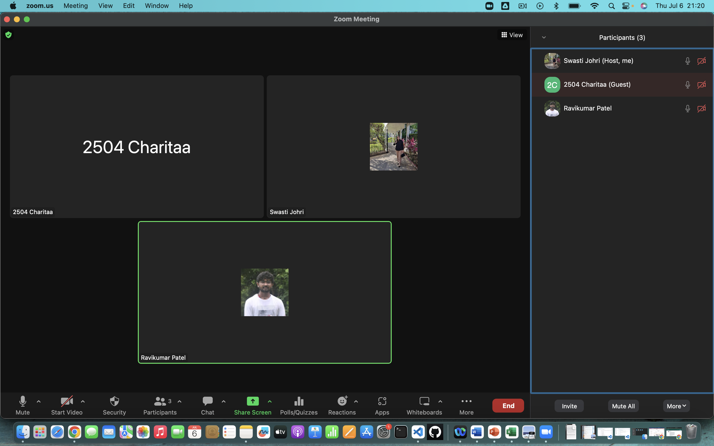
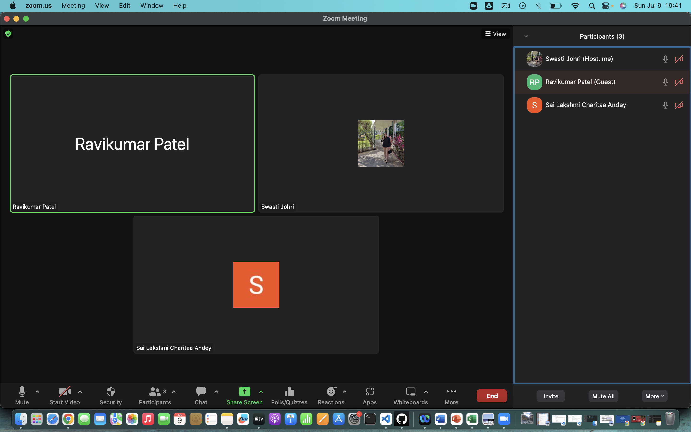
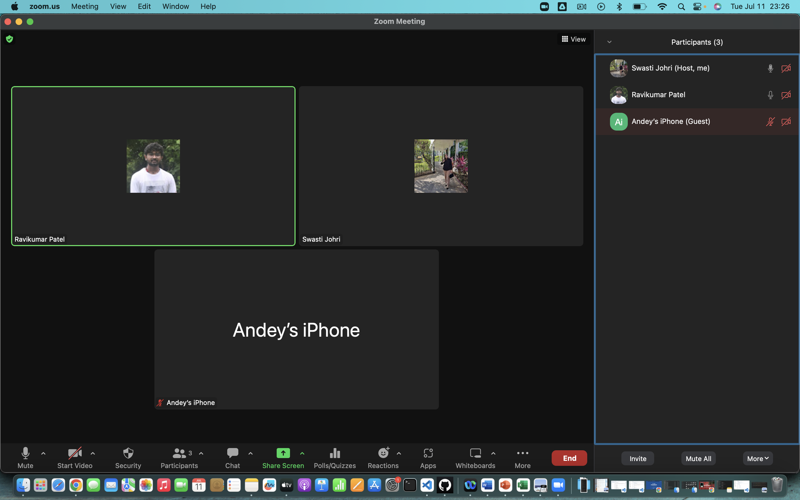
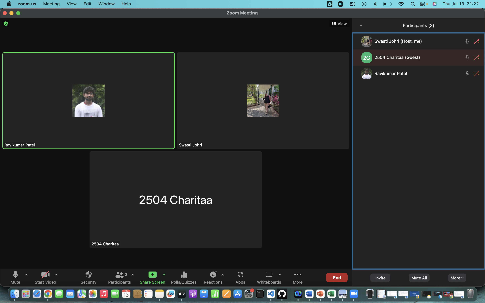
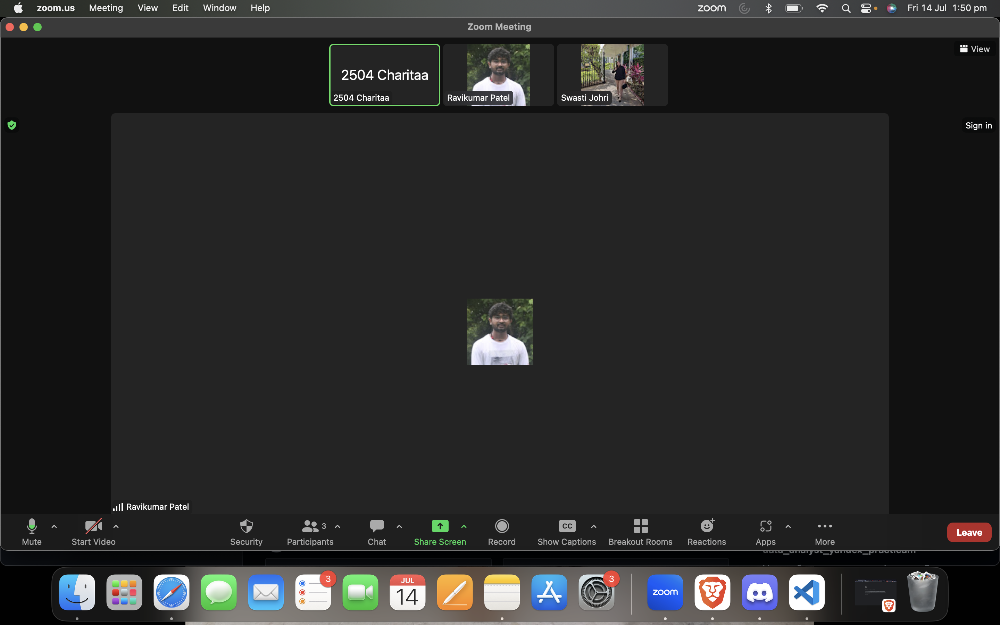
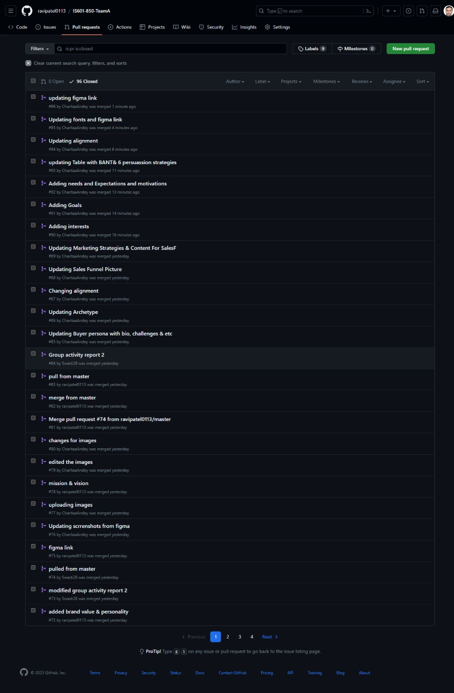
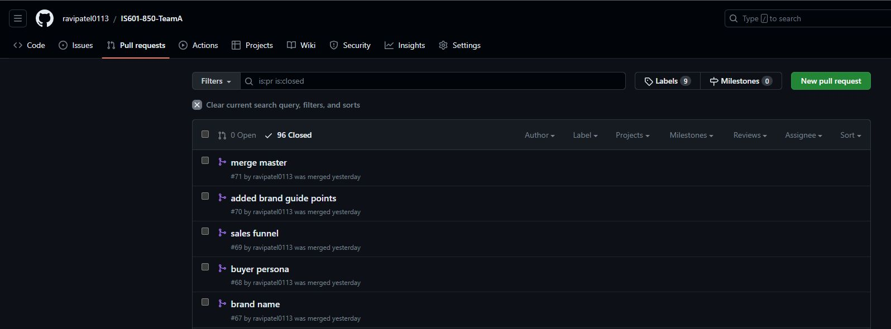

# Group Activity Report 3

| Pull Request Title | Description | Assignee | Story Points | Date Assigned | Date Completed |
| ------------------ | ----------- | -------- | ------------- | ------------- | -------------- |
| Created Brand Guide html | Created Html and css files for brand guide while inserting pictures from figma  | Swasti | 8 | 07/09/2023 | 07/13/2023 |
| Created Buyer Persona html | Created html and css file for buyer persona | Ravi | 8 | 07/09/2023 | 07/13/2023 |
| Created Marketing Strategies html| Created htmla nd css for marketing strategy, sales funnel and six methods of persuasion | Charitaa | 8 | 07/09/2023 | 07/13/2023 |
| Index Page | Created html and css file for the landing page  | Ravi | 8 | 07/12/2023 | 07/13/2023 |
| Playwright Tests| Created Playwright tests for the Webpage | Ravi | 5 | 7/12/2023 | 07/13/2023 |
| Webpage Deployment | Deploying Webpage on Github | Ravi | 1 | 7/13/2023 | 7/13/2023
| Group Activity Report 3 | Assign story points to the contribution with whole group on call | Charitaa | 2 | 07/14/2023 | 07/14/2023 |

## Project Contribution Percent Calculation

The project contribution percentage for each team member:

**Total Number of points:** 40
- Ravikumar's contribution percent: (22 / 40) * 100 = 55%
- Swasti's contribution percent: ( 8/ 40) * 100 = 20%
- Charitaa's contribution percent: ( 10/ 40) * 100 = 25%

## Meeting Attendance:

**Date:** 07/06/2023 (30 minutes)

**Date:** 07/09/2023 (2 hours)

**Date:** 07/11/2023 (1.5 hour)

**Date:** 07/13/2023 (5 hours)

**Date:** 07/14/2023 (2 hours)

## Pull Requests Made:

