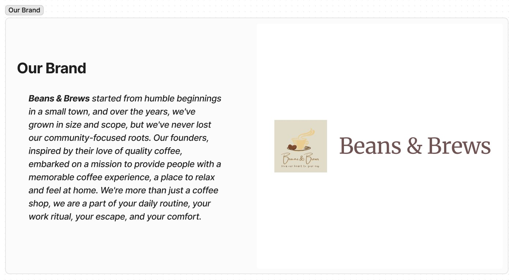
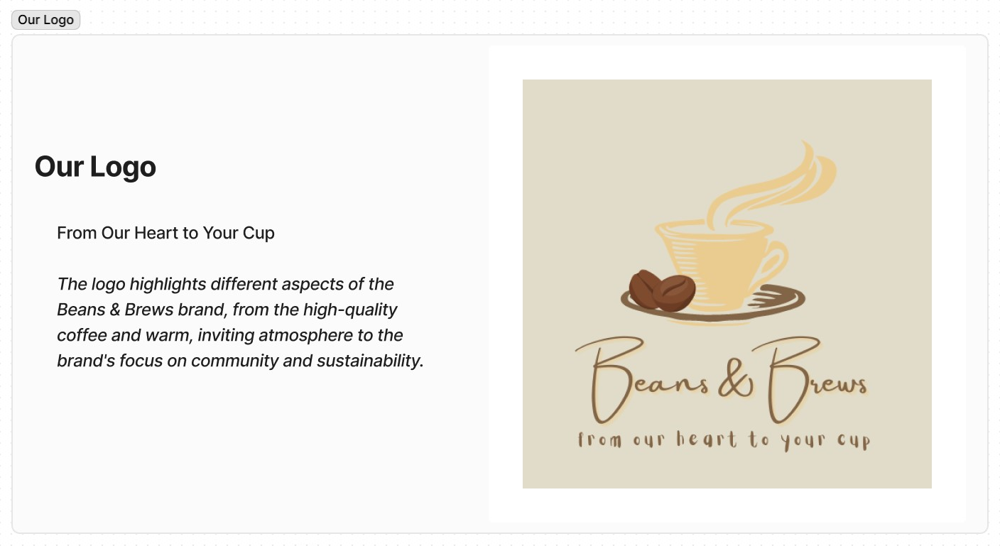
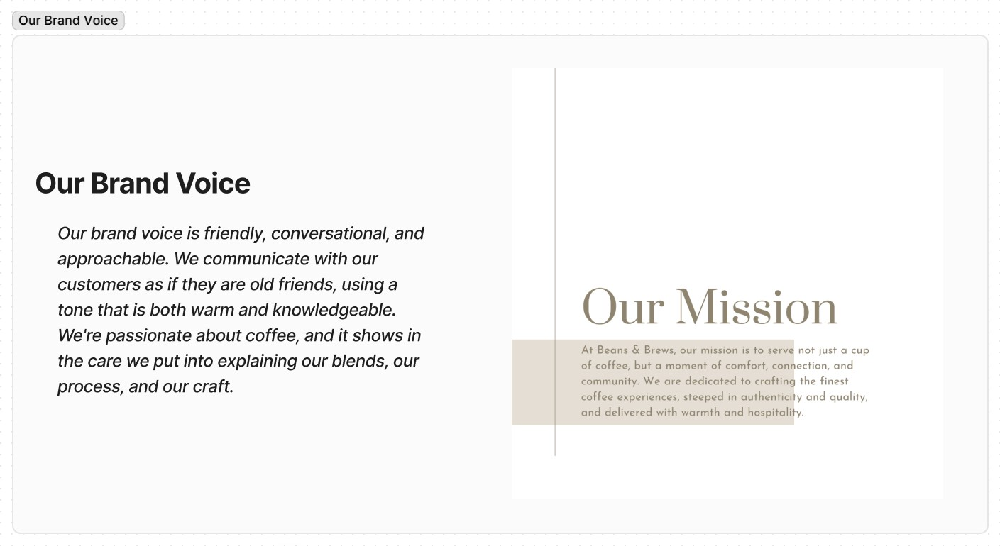
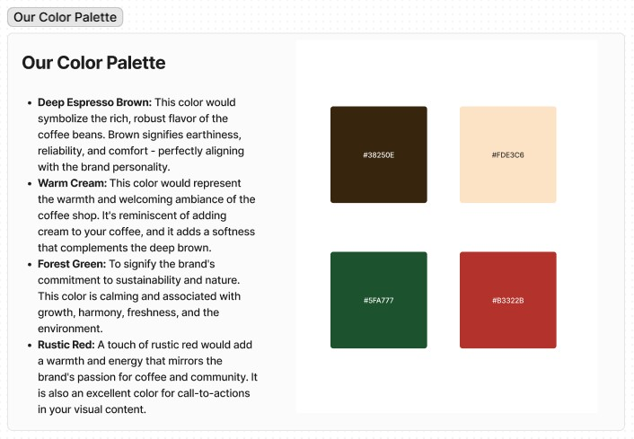

# Brand Guide

## Brand Name: "Beans & Brews"

**1. Our Brand:** Beans & Brews started from humble beginnings in a small town, and over the years, we've grown in size and scope, but we've never lost our community-focused roots. Our founders, inspired by their love of quality coffee, embarked on a mission to provide people with a memorable coffee experience, a place to relax and feel at home. We're more than just a coffee shop, we are a part of your daily routine, your work ritual, your escape, and your comfort.

**2. Our Logo:** _From Our Heart to Your Cup_

The logo highlights different aspects of the Beans & Brews brand, from the high-quality coffee and warm, inviting atmosphere to the brand's focus on community and sustainability.

**3. Our Brand Voice:** Our brand voice is friendly, conversational, and approachable. We communicate with our customers as if they are old friends, using a tone that is both warm and knowledgeable. We're passionate about coffee, and it shows in the care we put into explaining our blends, our process, and our craft.

**4. Our Color Palette:** 

- **Deep Espresso Brown:** This color would symbolize the rich, robust flavor of the coffee beans. Brown signifies earthiness, reliability, and comfort - perfectly aligning with the brand personality.

- **Warm Cream:** This color would represent the warmth and welcoming ambiance of the coffee shop. It's reminiscent of adding cream to your coffee, and it adds a softness that complements the deep brown.

- **Forest Green:** To signify the brand's commitment to sustainability and nature. This color is calming and associated with growth, harmony, freshness, and the environment.

- **Rustic Red:** A touch of rustic red would add a warmth and energy that mirrors the brand's passion for coffee and community. It is also an excellent color for call-to-actions in your visual content.

