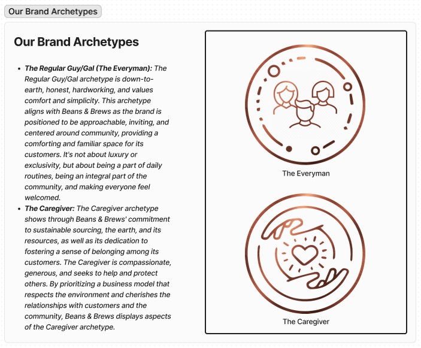
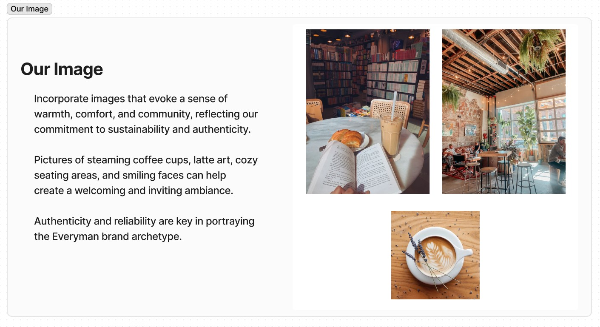
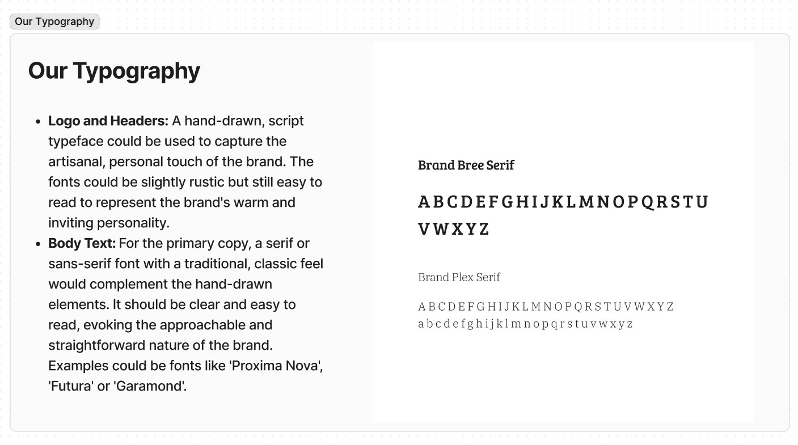
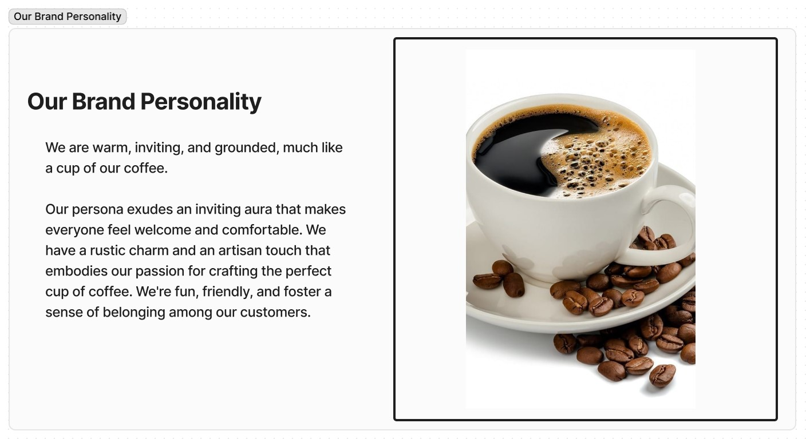

# Brand Guide

## Brand Name: "Beans & Brews"

**1. Our Brand:** Beans & Brews started from humble beginnings in a small town, and over the years, we've grown in size and scope, but we've never lost our community-focused roots. Our founders, inspired by their love of quality coffee, embarked on a mission to provide people with a memorable coffee experience, a place to relax and feel at home. We're more than just a coffee shop, we are a part of your daily routine, your work ritual, your escape, and your comfort.

**2. Our Logo:** _From Our Heart to Your Cup_

The logo highlights different aspects of the Beans & Brews brand, from the high-quality coffee and warm, inviting atmosphere to the brand's focus on community and sustainability.

**3. Our Brand Voice:** Our brand voice is friendly, conversational, and approachable. We communicate with our customers as if they are old friends, using a tone that is both warm and knowledgeable. We're passionate about coffee, and it shows in the care we put into explaining our blends, our process, and our craft.

**4. Our Color Palette:** 

- **Deep Espresso Brown:** This color would symbolize the rich, robust flavor of the coffee beans. Brown signifies earthiness, reliability, and comfort - perfectly aligning with the brand personality.

- **Warm Cream:** This color would represent the warmth and welcoming ambiance of the coffee shop. It's reminiscent of adding cream to your coffee, and it adds a softness that complements the deep brown.

- **Forest Green:** To signify the brand's commitment to sustainability and nature. This color is calming and associated with growth, harmony, freshness, and the environment.

- **Rustic Red:** A touch of rustic red would add a warmth and energy that mirrors the brand's passion for coffee and community. It is also an excellent color for call-to-actions in your visual content.

**5. Our Brand Archetypes:**

- **The Regular Guy/Gal (The Everyman):** The Regular Guy/Gal archetype is down-to-earth, honest, hardworking, and values comfort and simplicity. This archetype aligns with Beans & Brews as the brand is positioned to be approachable, inviting, and centered around community, providing a comforting and familiar space for its customers. It's not about luxury or exclusivity, but about being a part of daily routines, being an integral part of the community, and making everyone feel welcomed.

- **The Caregiver:** The Caregiver archetype shows through Beans & Brews' commitment to sustainable sourcing, the earth, and its resources, as well as its dedication to fostering a sense of belonging among its customers. The Caregiver is compassionate, generous, and seeks to help and protect others. By prioritizing a business model that respects the environment and cherishes the relationships with customers and the community, Beans & Brews displays aspects of the Caregiver archetype.

**6. Our Image:** Incorporate images that evoke a sense of warmth, comfort, and community, reflecting our commitment to sustainability and authenticity.
Pictures of steaming coffee cups, latte art, cozy seating areas, and smiling faces can help create a welcoming and inviting ambiance.
Authenticity and reliability are key in portraying the Everyman brand archetype.

**7. Our Typography:** 

- **Logo and Headers:** A hand-drawn, script typeface could be used to capture the artisanal, personal touch of the brand. The fonts could be slightly rustic but still easy to read to represent the brand's warm and inviting personality.

- **Body Text:** For the primary copy, a serif or sans-serif font with a traditional, classic feel would complement the hand-drawn elements. It should be clear and easy to read, evoking the approachable and straightforward nature of the brand. Examples could be fonts like 'Proxima Nova', 'Futura' or 'Garamond'.

**8. Our Brand Value:** We are committed to authenticity, quality, and sustainability. We believe in doing business in a way that respects our earth and its resources. That's why we source our beans from responsible and sustainable farms, and our brewing process is always respectful of the environment. We value the relationships we build with our customers and the community, making them the heart of everything we do.

**9. Our Brand Personality:** We are warm, inviting, and grounded, much like a cup of our coffee. Our persona exudes an inviting aura that makes everyone feel welcome and comfortable. We have a rustic charm and an artisan touch that embodies our passion for crafting the perfect cup of coffee. We're fun, friendly, and foster a sense of belonging among our customers.

